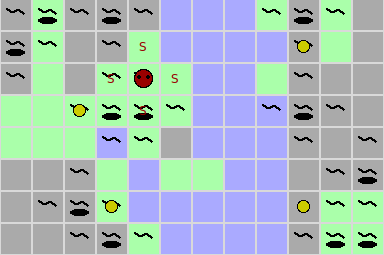
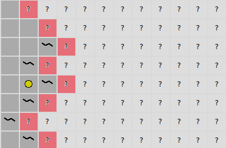

# FAULumpus


## Rules
Your agent acts in the FAULumpus world – a variant of the Wumpus world with an Erlangen theme.

#### The world
The FAULumpus world consists of 12x8 squares.
A square can have different types: grass, stone and water.
Water is usually in the middle of the map (Regnitz).
The type of a square doesn't make any difference except that there are no pits in the water.

Some squares have pits on them and one square has the Wumpus.
The squares next to a pit have a breeze and the squares around the Wumpus have a smell.
Furthermore, four squares contain an Erlangen sight.



#### Possible moves
There are two types of moves: exploration and finishing.
You can explore any square adjacent to one that has already been explored (in the screenshot below,
the red squares can be explored). The player location is irrelevant, i.e. you could first explore a square
on the bottom and next a square on the top.
Initially, only the (0,0) square is explored (bottom left corner).
If your agent decides that any further move would do more harm than good,
it can decide to finish the game to collect the points and avoid death (see next section).



#### Points, death and evaluation
Your agent has to find as many sights as possible.
If your agent finds *n* sights, it gets a score of *n²*.
However, your agent will die if it steps on a square with a pit or the wumpus.
In that case, the agent will get 0 points – no matter how many sights it had found.
Therefore, your agent should finish the game at some point.
Note that illegal moves are also lethal.

Your agent will be evaluated based on the maximum average score of 1000
consecutive games played on the server.

To illustrate the evaluation, let's pretend for a moment that your agent is
evaluated based on the maximum average score of 3 consecutive games rather than 1000.
Let us say your agent gets the following scores in consecutive games: 4, 1, 1, 4, 16, 4, 1, 16.
Then its evaluation would be (4+16+4)/3 = 8, as that is the maximum of three consecutive games.

## Requirements
You need to have a recent Python version.
Furthermore, you will need the `requests` library.
You should be able to install it with `pip`:
```
pip3 install requests
```

## Creating an agent
You can create a new agent by modifying `agent.py`.
The file contains the relevant instructions.
Don't forget to set appropriate values for `AGENT_NAME`, `AGENT_PASSWORD` and `AGENT` at the end of the file!

## Testing your agent locally
You should be able to test your agent locally.
You can start a server on localhost using
```
python3 server.py
```
To test your agent, you can then start the client with
```
python3 client.py
```

To see how your agent performs, the server can visualize the games.
Simply start the server with the `-visualize` option:
```
python3 server.py -visualize
```
You can run the client with the `-step` option to wait for your input before each move:
```
python3 client.py -step
```

If you press the left control key in the server's GUI, you can see the undiscovered squares.


## Competing on `faulumpus.kwarc.info`
To compete with your agent on `faulumpus.kwarc.info`, you have to pass the `-compete` option to the client:
```
python3 client.py -compete
```


## The world generator
If you want to get a feeling for what the FAULumpus world looks like,
you can run
```
python3 generate.py
```
It displays randomly generated worlds.
Press `Return` to show generate a new world.
